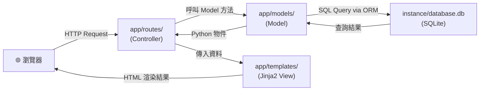
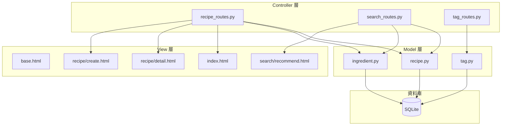

# 系統架構文件 — 食譜收藏系統

## 1. 技術架構說明

### 選用技術與原因

| 技術 | 角色 | 選用原因 |
|------|------|----------|
| **Python + Flask** | 後端 Web 框架 | 輕量、易上手，適合小型個人專案；豐富的擴充套件生態系 |
| **Jinja2** | 前端模板引擎 | Flask 內建，可直接在 HTML 中嵌入 Python 變數與控制流程，不需前後端分離 |
| **SQLite** | 關聯式資料庫 | 零設定、單一檔案，適合個人使用量輕的應用；Python 標準函式庫內建支援 |
| **SQLAlchemy** | ORM | 以 Python 物件操作資料庫，避免手寫 SQL、防止 SQL Injection |

### Flask MVC 模式說明

```
Model（模型）     → app/models/
                   負責定義資料結構、與 SQLite 互動（讀寫查刪）

View（視圖）      → app/templates/
                   Jinja2 HTML 模板，負責將資料呈現給使用者

Controller（控制器）→ app/routes/
                   Flask 路由函式，接收請求、呼叫 Model 取得資料、
                   再將結果交給 View 渲染後回傳給瀏覽器
```

---

## 2. 專案資料夾結構

```
food_recipe_app/
│
├── app/                        ← 主要應用程式套件
│   ├── __init__.py             ← 初始化 Flask app、註冊 Blueprint
│   │
│   ├── models/                 ← Model 層（資料庫模型）
│   │   ├── __init__.py
│   │   ├── recipe.py           ← Recipe 資料表模型
│   │   ├── ingredient.py       ← Ingredient 資料表模型
│   │   └── tag.py              ← Tag / Category 資料表模型
│   │
│   ├── routes/                 ← Controller 層（Flask 路由）
│   │   ├── __init__.py
│   │   ├── recipe_routes.py    ← 食譜 CRUD 路由
│   │   ├── search_routes.py    ← 搜尋與食材推薦路由
│   │   └── tag_routes.py       ← 分類標籤路由
│   │
│   ├── templates/              ← View 層（Jinja2 HTML 模板）
│   │   ├── base.html           ← 共用版型（導覽列、頁尾）
│   │   ├── index.html          ← 首頁：食譜列表
│   │   ├── recipe/
│   │   │   ├── detail.html     ← 食譜詳細頁
│   │   │   ├── create.html     ← 新增食譜表單
│   │   │   └── edit.html       ← 編輯食譜表單
│   │   ├── search/
│   │   │   ├── results.html    ← 搜尋結果頁
│   │   │   └── recommend.html  ← 食材推薦結果頁
│   │   └── tag/
│   │       └── list.html       ← 分類瀏覽頁
│   │
│   └── static/                 ← 靜態資源
│       ├── css/
│       │   └── style.css       ← 自訂樣式
│       └── js/
│           └── main.js         ← 前端互動邏輯（如動態新增食材欄位）
│
├── instance/
│   └── database.db             ← SQLite 資料庫檔案（自動產生，不納入版控）
│
├── database/
│   └── schema.sql              ← 初始建表 SQL（用於文件說明）
│
├── docs/                       ← 設計文件
│   ├── PRD.md
│   ├── ARCHITECTURE.md         ← 本檔案
│   ├── FLOWCHART.md
│   ├── DB_DESIGN.md
│   └── ROUTES.md
│
├── app.py                      ← 應用程式進入點（啟動 Flask）
├── config.py                   ← 設定檔（資料庫路徑、Secret Key 等）
├── requirements.txt            ← Python 套件清單
└── .gitignore                  ← 忽略 instance/、__pycache__/ 等
```

---

## 3. 元件關係圖

### 請求處理流程



### 系統元件職責



---

## 4. 關鍵設計決策

### 決策 1：使用 Blueprint 組織路由

Flask Blueprint 讓我們把不同功能的路由分開放在不同檔案，避免所有路由堆在 `app.py` 裡。每個功能模組（食譜、搜尋、標籤）各自是一個 Blueprint，在 `app/__init__.py` 統一註冊。

### 決策 2：SQLAlchemy ORM 取代原生 sqlite3

雖然 Python 內建 `sqlite3` 模組，但使用 SQLAlchemy ORM 可以：
- 以 Python 類別定義資料表，減少 SQL 錯誤
- 自動防止 SQL Injection
- 方便日後遷移至其他資料庫（如 PostgreSQL）

### 決策 3：食材（Ingredient）獨立為資料表

食譜與食材是一對多關係（一個食譜有多個食材），因此食材獨立為 `recipes_ingredients` 關聯表。這樣食材推薦功能可以透過 SQL JOIN 查詢，找出「含有這些食材」的食譜。

### 決策 4：Tag 使用多對多設計

一個食譜可以有多個標籤（中式、快速料理），一個標籤也可以對應多個食譜。採用中間表 `recipe_tags` 實現多對多關聯，方便分類篩選。

### 決策 5：不實作使用者登入系統

依 PRD 定義，本系統為個人單人使用，因此省略使用者驗證機制，降低開發複雜度。未來如需多用戶支援，可透過 Flask-Login 擴充。
