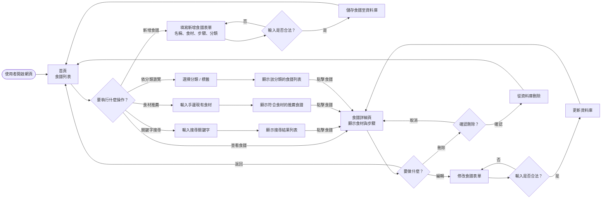
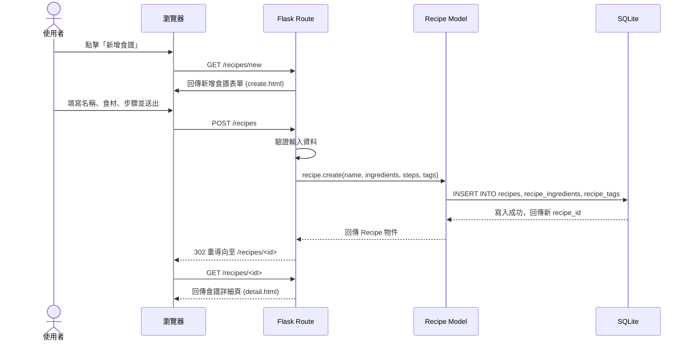
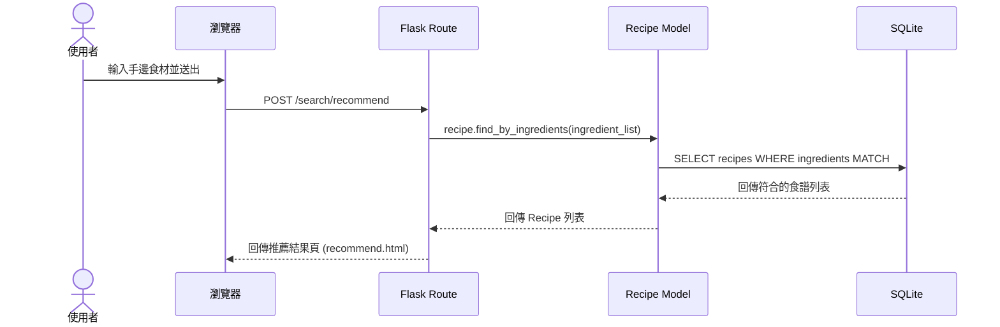
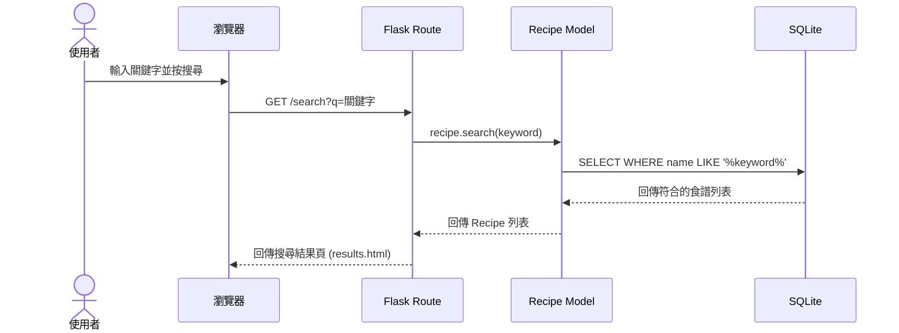

# 流程圖文件 — 食譜收藏系統

## 1. 使用者流程圖（User Flow）

描述使用者從開啟網頁到完成各項操作的路徑。

---

## 2. 系統序列圖（Sequence Diagram）

### 2-A：新增食譜

### 2-B：食材推薦食譜

### 2-C：關鍵字搜尋

---

## 3. 功能清單對照表

| 功能 | URL 路徑 | HTTP 方法 | 說明 |
|------|----------|-----------|------|
| 首頁 / 食譜列表 | `/` | GET | 顯示所有食譜 |
| 食譜詳細頁 | `/recipes/<id>` | GET | 顯示單一食譜詳情 |
| 新增食譜表單 | `/recipes/new` | GET | 顯示新增表單 |
| 儲存新增食譜 | `/recipes` | POST | 接收表單、寫入資料庫 |
| 編輯食譜表單 | `/recipes/<id>/edit` | GET | 顯示編輯表單（帶入現有資料） |
| 更新食譜 | `/recipes/<id>` | POST | 接收修改後的資料、更新資料庫 |
| 刪除食譜 | `/recipes/<id>/delete` | POST | 從資料庫刪除指定食譜 |
| 關鍵字搜尋 | `/search` | GET | 接收 `q` 參數，搜尋食譜名稱與內容 |
| 食材推薦 | `/search/recommend` | GET / POST | 輸入食材清單，回傳推薦食譜 |
| 依標籤瀏覽 | `/tags/<tag_name>` | GET | 顯示特定分類的食譜列表 |
